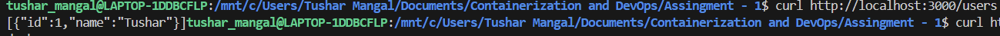
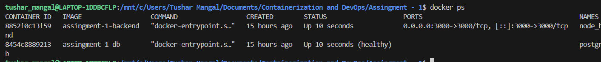
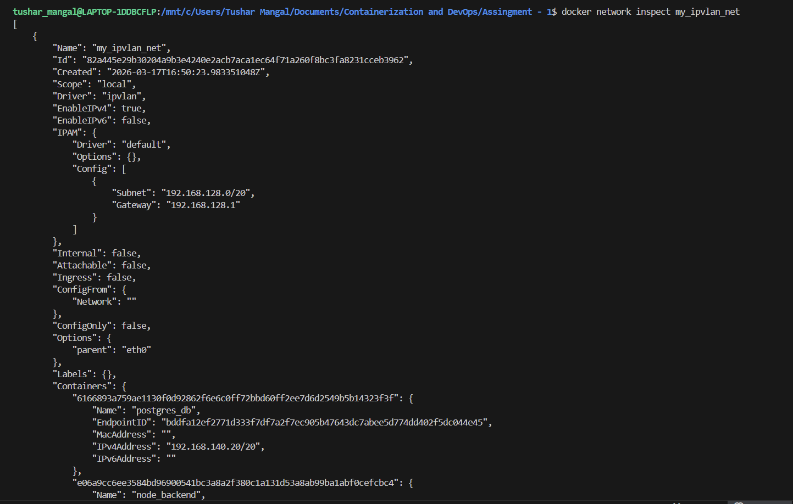
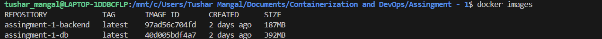
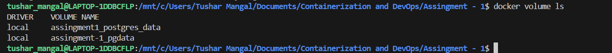
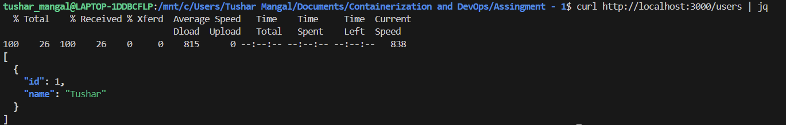
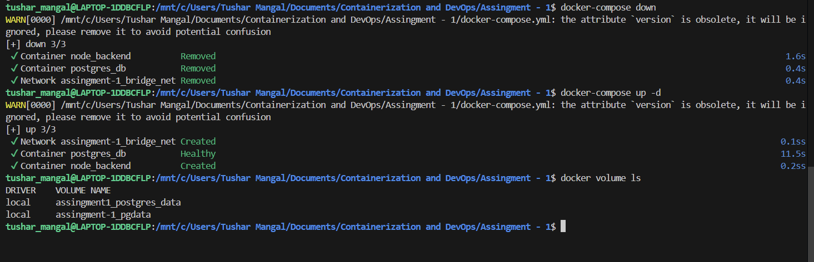

# 🚀 Containerized Web Application with PostgreSQL using Docker Compose & Macvlan

## 📚 Course Information
**University:** University of Petroleum and Energy Studies  
**Course:** Containerization and DevOps  
**Assignment:** Containerized Web Application with PostgreSQL using Docker Compose and Macvlan  

---

## 📌 Project Overview

This project demonstrates a
**containerized backend application**  using:

- **Node.js + Express (Backend API)** 
- **PostgreSQL (Database)** 
- **Docker & Docker Compose** 
- **IPVLAN Networking (static IP assignment)**
- **Bridge Network (for host access in WSL)** 
- **Persistent Storage using Docker Volumes** 

The system showcases **production-ready practices** including multi-stage builds, optimized images, networking, and service orchestration.

---

## 🏗️ Architecture

```text
  Client (Postman / Browser) 
          │ 
          ▼
  Backend Container (Node.js) 192.168.140.10 
          │ 
          ▼ 
  PostgreSQL Container 192.168.140.20

```

---

## 📁 Repository Structure

```text
    project/ 
    ├── backend/ 
    │ ├── src/ 
    │ ├── Dockerfile 
    │ ├── package.json 
    │ └── .dockerignore 
    │
    ├── database/ 
    │ ├── Dockerfile 
    │ └── init.sql 
    │ 
    ├── docker-compose.yml 
    ├── .env 
    └── README.md
```

## backend/index.js
```bash
const express = require("express");
const { Pool } = require("pg");

const app = express();
app.use(express.json());

const pool = new Pool({
  host: process.env.DB_HOST,
  user: process.env.DB_USER,
  password: process.env.DB_PASSWORD,
  database: process.env.DB_NAME,
  port: 5432
});

// Healthcheck
app.get("/health", (req, res) => res.send("OK"));

// POST
app.post("/users", async (req, res) => {
  const { name } = req.body;
  const result = await pool.query(
    "INSERT INTO users(name) VALUES($1) RETURNING *",
    [name]
  );
  res.json(result.rows[0]);
});

// GET
app.get("/users", async (req, res) => {
  const result = await pool.query("SELECT * FROM users");
  res.json(result.rows);
});

// 🚀 START SERVER PROPERLY
async function startServer() {
  try {
    await pool.query(`
      CREATE TABLE IF NOT EXISTS users (
        id SERIAL PRIMARY KEY,
        name TEXT
      )
    `);
    console.log("Table ready");

    app.listen(3000, "0.0.0.0", () => {
      console.log("Server running on port 3000");
    });

  } catch (err) {
    console.error("Startup error:", err);
    process.exit(1);
  }
}

startServer();
```
## 📂 backend/package.js
```bash
{
  "name": "app",
  "version": "1.0.0",
  "main": "src/index.js",
  "dependencies": {
    "express": "^4.18.2",
    "pg": "^8.11.0"
  }
}
```
## 📂 backend/Dockerfile
```bash
# Stage 1
FROM node:18-alpine AS builder
WORKDIR /app
COPY package*.json ./
RUN npm install --only=production
COPY . .

# Stage 2
FROM node:18-alpine
WORKDIR /app

RUN addgroup -S appgrp && adduser -S appusr -G appgrp

COPY --from=builder /app /app

USER appusr

EXPOSE 3000
CMD ["node", "src/index.js"]

```
## 📂 backend/.dockerignore
```bash
node_modules
.git
```
## 📂 Database/init.sql
```bash
CREATE TABLE IF NOT EXISTS users (
    id SERIAL PRIMARY KEY,
    name TEXT
);
```
## 📂 database/Dockerfile
```bash
FROM postgres:15-alpine

USER postgres

COPY init.sql /docker-entrypoint-initdb.d/
```
## docker-compose.yml
```bash
version: "3.9"

services:

  db:
    build: ./database
    container_name: postgres_db
    restart: always
    env_file: .env
    environment:
      POSTGRES_DB: ${POSTGRES_DB}
      POSTGRES_USER: ${POSTGRES_USER}
      POSTGRES_PASSWORD: ${POSTGRES_PASSWORD}
    volumes:
      - pgdata:/var/lib/postgresql/data
    networks:
      my_ipvlan_net:
        ipv4_address: 192.168.140.20
    healthcheck:
      test: ["CMD-SHELL", "pg_isready -U myuser"]
      interval: 10s
      retries: 5

  backend:
    build: ./backend
    container_name: node_backend
    restart: always
    depends_on:
      db:
        condition: service_healthy
    env_file: .env

    networks:
      my_ipvlan_net:
        ipv4_address: 192.168.140.10
      bridge_net:   # 👈 ADD THIS
        # no static IP needed

    ports:
      - "3000:3000"

networks:
  my_ipvlan_net:
    external: true
  bridge_net:
    driver: bridge
volumes:
  pgdata:
```
## Create Macvlan Network
Create the macvlan network:

```bash
docker network create -d macvlan \
--subnet=192.168.64.0/24 \
--gateway=192.168.64.1 \
-o parent=enp0s1 \
mymacvlan

```


## 🚀 Build and Run

### Step 1: Build Images

```bash
docker-compose build
```
### Step 2: Start Containers

```bash
docker-compose up -d
```
### Step 3: Check running containers
```bash
docker ps
```


## Test API
### Health Check
```bash
curl http://localhost:3000/health
```

### Insert Record
```bash
curl -X POST http://localhost:3000/users \
-H "Content-Type: application/json" \
-d '{"name":"Tushar"}'
```
### Fetch users
```bash
curl http://localhost:3000/users
```

## Verify containers
```bash
docker ps
```

## Verify Network
```bash
docker network inspect my_ipvlan_net
```

## Verify Images
```bash
docker images
```

## Verify Volumes
```bash
docker volume ls
```

## Verify Volume Persistence


### Step 1 — Insert Data into Database
```bash
curl -X POST http://localhost:3000/users \
-H "Content-Type: application/json" \
-d '{"name":"Tushar"}'
```
### Step 2 — Stop Containers
```bash
docker-compose down
```
### Step 3 — Restart Containers
```bash
docker-compose up -d
```
### Step 4 — Verify Data Persistence
```bash
curl http://localhost:3000/users
```

### Step 5 — Verify Docker Volume
```bash
docker volume ls
```
