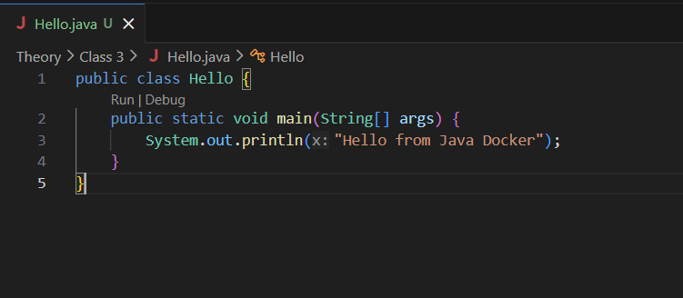
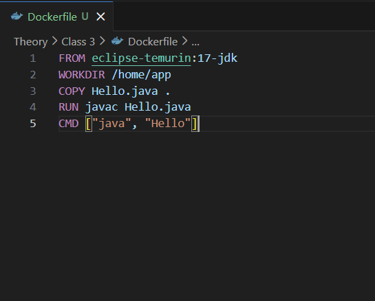
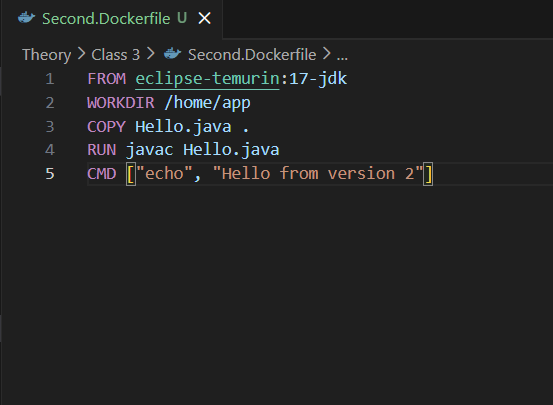
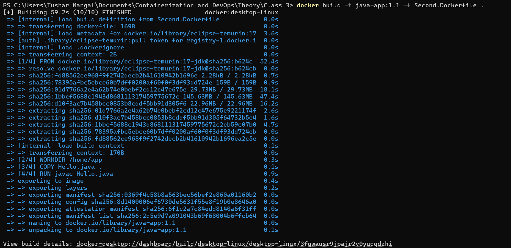
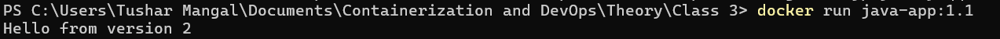
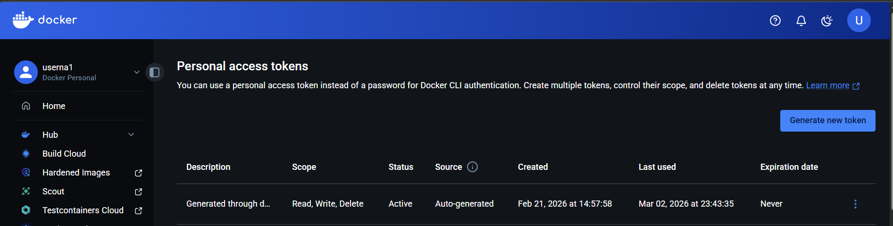
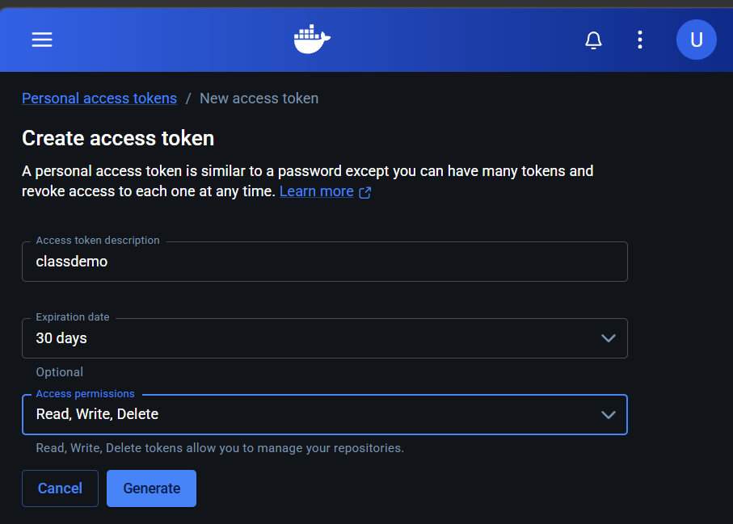
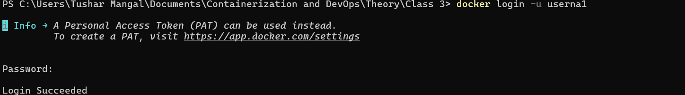
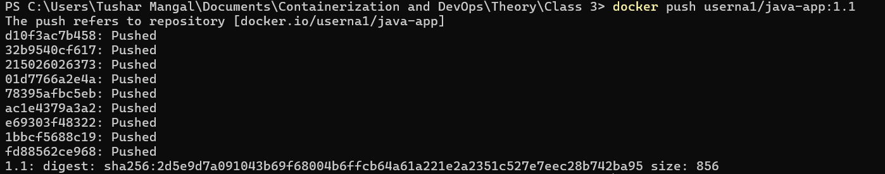
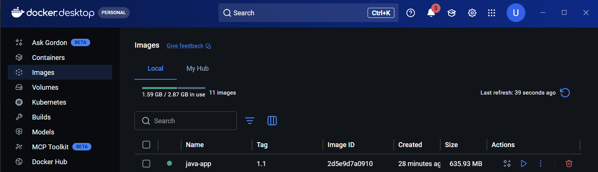

# Class 3 – Java Docker Application
---

## Objective
To containerize a simple Java application using Docker, build images using different Dockerfiles, run containers, and push the image to Docker Hub.

---


## Step 1 – Create Java Application

### Hello.java
```java
public class Hello {
    public static void main(String[] args) {
        System.out.println("Hello from Java Docker");
    }
}
```

---

## Step 2 – Create Dockerfile (Version 1)

```dockerfile
FROM eclipse-temurin:17-jdk
WORKDIR /home/app
COPY Hello.java .
RUN javac Hello.java
CMD ["java", "Hello"]
```


---

## Step 3 – Create second.Dockerfile (Version 2)

```dockerfile
FROM eclipse-temurin:17-jdk
WORKDIR /home/app
COPY Hello.java .
RUN javac Hello.java
CMD ["echo", "Hello from version 2"]
```


---

## Step 4 – Build Image Using second.Dockerfile

Command:
```
docker build -t java-app:1.1 -f Second.Dockerfile .
```



---

## Step 5 – Run the Container

Command:
```
docker run java-app:1.1
```

Output:
```
Hello from version 2
```



---

## Step 6 – Generate Docker Hub Personal Access Token




---

## Step 7 – Login to Docker Hub

Command:
```
docker login -u userna1
```



---

## Step 8 – Tag the Image

Command:
```
docker tag java-app:1.1 userna1/java-app:1.1
```


---

## Step 9 – Push Image to Docker Hub

Command:
```
docker push userna1/java-app:1.1
```



---

## Step 10 – Image Available on Docker Hub



---

## Result
Successfully:
- Containerized Java application
- Built Docker image
- Ran container
- Tagged image
- Pushed image to Docker Hub